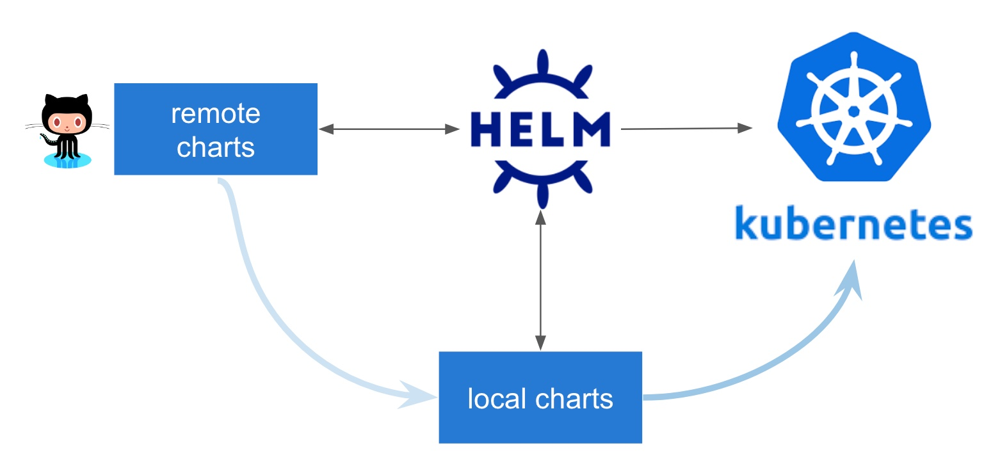

# Helm, Kustomize & Flux

by [Tim](https://github.com/tmstff) and [Volker](https://github.com/saltyblu)

## Helm



[Helm](https://helm.sh/docs) serves for two main purposes:

* package management for kubernetes (e.g. please install postgres)
* templating for kubernetes yamls

### Package Management Example: Maria DB

* [install helm](https://helm.sh/docs/intro/install/)
* GKE Cluster erstellen ( e.g. in [https://console.cloud.google.com/kubernetes/list?project=playground-277208](https://console.cloud.google.com/kubernetes/list?project=playground-277208) )
* Maria DB Source: https://github.com/bitnami/charts/tree/master/bitnami/mariadb

```bash
helm repo add bitnami https://charts.bitnami.com/bitnami
helm search repo bitnami
helm install mdb bitnami/mariadb
helm ls
helm uninstall mdb
helm ls

# optional
kubectl create namespace mariadb 

helm install mariadb bitnami/mariadb --set architecture=replication,secondary.replicaCount=2,auth.database=ta_youtrain
helm install mariadb bitnami/mariadb -f values.yaml
```

### Deploy Custom Application

Example application:

* frontend: [https://gitlab.com/tarent/youtrain](https://gitlab.com/tarent/youtrain) 
    * Docker image: us.gcr.io/playground-277208/gcf/youtrain
* backend: [https://gitlab.com/tarent/youtrain-server](https://gitlab.com/tarent/youtrain-server)
    * Docker image: us.gcr.io/playground-277208/gcf/youtrain-server

```bash
helm create youtrain

# optional
helm package youtrain
helm install youtrain ./youtrain-0.1.0.tgz

helm lint
helm install youtrain ./youtrain --dry-run --debug
```

### HELM Tiller

Older construct using a kubernetes pod for mainiting release information and applying patches and changes to resources. [Obsolete as per Helm 3](https://www.heise.de/developer/meldung/Kubernetes-Paketmanager-Helm-3-verzichtet-auf-Tiller-4586105.html).
